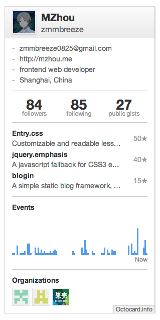

Octocard
===
Highly flexible github info card for every github lover. And it's open source. Please feel free to fork and build your own Octocard.

How to use
---
Easy way? Copy the following html code to your website.

    

Advanced way:

    

    
    

How to customize theme
---

1. `git clone https://github.com/zmmbreeze/octocard.git`
2. `cd octocard/themes`
3. `cp default.css mytheme.css`
4. Change the css style as you wish.
5. `cd ../`
6. `npm install`
7. `grunt --theme=mytheme`
8. Then your will get `bin/octocard.mytheme.js`.

Server part
---
Octocard works on node server. You can use [octocard.info](http://octocard.info/). It's free. But if you want to build your own server, checkout [server part](https://github.com/zmmbreeze/octocard-server).

