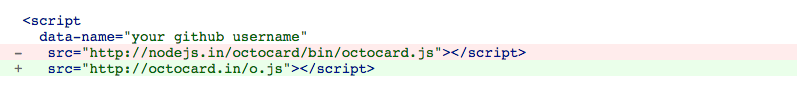

Octocard
===
Highly flexible github info card for every github lover. And it's open source. Please feel free to fork and build your own Octocard.

> Octocard now using a new domain name octocard.in! The old domain was stolen, so for safety concern please update the code like this:
> 
> Really sorry for this, and thank you for your support.

- [HOW TO USE](https://github.com/zmmbreeze/octocard/wiki/HOW-TO-USE)
- [Customize theme](https://github.com/zmmbreeze/octocard/wiki/Customize-theme)

Server part
---
Octocard works on node server. You can use [octocard.in](http://octocard.in/). It's free. But if you want to build your own server, checkout [server part](https://github.com/zmmbreeze/octocard-server).

